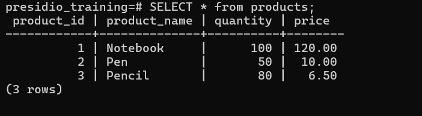

# Task 1

## **Creating and Populating Tables**
    
**Objective:**
    
- Set up a simple table, insert data, and retrieve that data using basic queries.
    
**Requirements:**
    
- Use `CREATE TABLE` to define a table (e.g., `Employees` or `Products`) with appropriate data types and constraints.
- Populate the table using `INSERT INTO` with multiple rows of sample data.
- Execute a basic `SELECT * FROM TableName;` query to verify the data insertion.


# Steps Followed:

## 1. Create Table `Products`

``` sql
CREATE TABLE products (product_id serial PRIMARY KEY, product_name varchar(100), quantity integer, price numeric(8,2));
```


## 2. Insert data into Table

``` sql
INSERT INTO products(product_name, quantity, price) VALUES ('Notebook',100,120.00),('Pen',50,10),('Pencil',80,6.50);
```


## 3. Retrieve data from Table

``` sql
SELECT * FROM products;
```
