# Task 10

## **Comprehensive Database Design, Optimization, and Advanced FeaturesObjective:Requirements:**
- Design a normalized database schema for a complex business scenario (e.g., an eCommerce platform) and implement advanced SQL features to ensure performance, data integrity, and automation.
- **Schema Design:**
    - Design and create multiple related tables (e.g., `Products`, `Customers`, `Orders`, `OrderDetails`) with proper primary and foreign keys, unique constraints, and normalization practices.
- **Indexing and Performance:**
    - Analyze query performance and apply indexing strategies to optimize frequently executed queries.
- **Triggers:**
    - Implement triggers to enforce business rules automatically (e.g., update inventory levels upon order insertion, log changes to critical tables).
- **Transactions:**
    - Use transactions (`BEGIN TRANSACTION`, `COMMIT`, and `ROLLBACK`) to ensure data consistency during multi-step operations (e.g., order processing where multiple tables are updated).
- **Views and Materialized Views (Optional):**
    - Create views to simplify complex joins and aggregations.
    - Optionally, design materialized views if your SQL dialect supports them to cache expensive query results.
- **Documentation and Testing:**
    - Document your schema and SQL scripts.
    - Write test queries to demonstrate that all constraints, triggers, and transactions work as intended.


# Steps Followed:

## 1. Create Table

- `Products` Table
``` sql
CREATE TABLE products_task10 (
    product_id SERIAL PRIMARY KEY, 
    product_name VARCHAR(20),
    quantity INTEGER CHECK (quantity >= 0), 
    price NUMERIC(8,2)
);
```
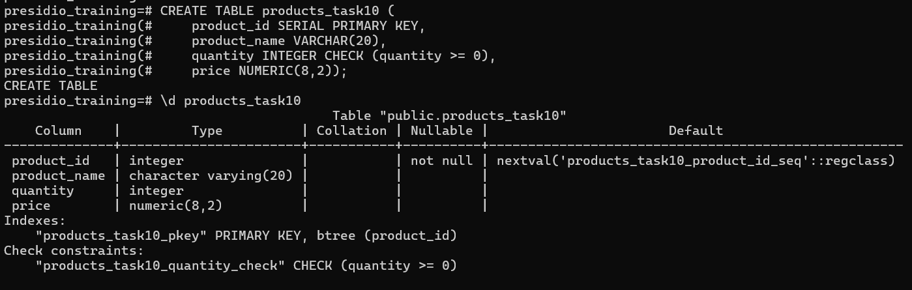

- `Customers` Table
``` sql
CREATE TABLE customers_task10 (
    customer_id SERIAL PRIMARY KEY, 
    customer_name VARCHAR(50), 
    email VARCHAR(50) UNIQUE CHECK (email LIKE '%@%.%'),
    phone NUMERIC(10) UNIQUE CHECK (phone > 1000000000)
);
```
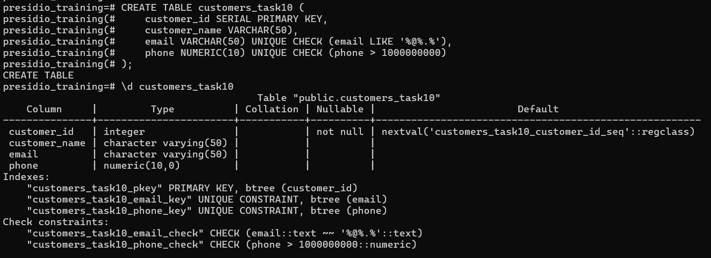

- `Orders` Table
``` sql
CREATE TABLE orders_task10 (
    order_id SERIAL PRIMARY KEY, 
    customer_id INTEGER, 
    product_id INTEGER,
    quantity_purchased INTEGER CHECK (quantity_purchased > 0),
    total_amount NUMERIC(10,2) NOT NULL,
    FOREIGN KEY (customer_id) REFERENCES customers_task10(customer_id),
    FOREIGN KEY (product_id) REFERENCES products_task10(product_id)
);
```
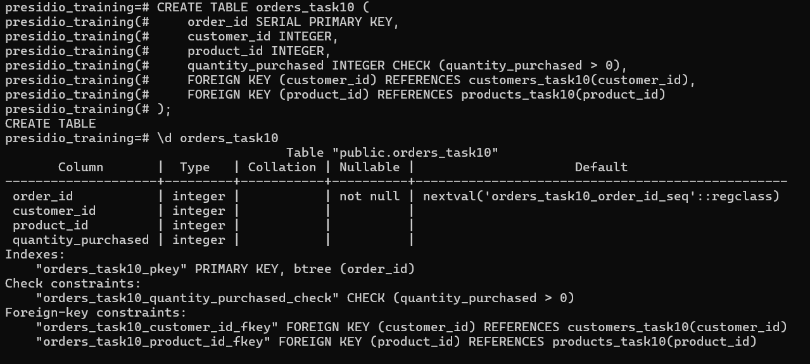


## 2. Populate data into `products_task10` and `customers_task10` table

``` sql
INSERT INTO products_task10 (product_name, quantity, price) VALUES
('Laptop', 10, 850.00),
('Smartphone', 20, 499.99),
('Headphones', 30, 79.99),
('Tablet', 15, 299.50),
('Smartwatch', 25, 199.99),
('Camera', 8, 599.00),
('Printer', 12, 149.99),
('Monitor', 18, 220.75),
('Keyboard', 35, 45.50),
('Mouse', 40, 25.99);
```

``` sql
INSERT INTO customers_task10 (customer_name, email, phone) VALUES
('Alice Johnson', 'alice.j@example.com', 9876543210),
('Bob Smith', 'bob.smith@example.com', 9123456789),
('Charlie Brown', 'charlie.b@example.com', 9234567890),
('David Lee', 'david.lee@example.com', 9345678901),
('Emily Davis', 'emily.d@example.com', 9456789012),
('Frank Wilson', 'frank.w@example.com', 9567890123),
('Grace Hall', 'grace.h@example.com', 9678901234),
('Hannah White', 'hannah.w@example.com', 9789012345),
('Ian King', 'ian.k@example.com', 9890123456),
('Jack Black', 'jack.b@example.com', 9901234567);
```

## 3. Create Trigger

### Before Insert Trigger
``` sql
CREATE OR REPLACE FUNCTION add_order()
RETURNS TRIGGER AS
$$
    DECLARE
        product_cost NUMERIC(8,2);
    BEGIN
        SELECT price INTO product_cost FROM products_task10 WHERE product_id = NEW.product_id;

        NEW.total_amount := NEW.quantity_purchased * product_cost;

        RETURN NEW;
    END;
$$
LANGUAGE plpgsql;
```

``` sql
CREATE TRIGGER before_insert_orders 
BEFORE INSERT ON orders_task10
FOR EACH ROW
EXECUTE FUNCTION add_order();
```
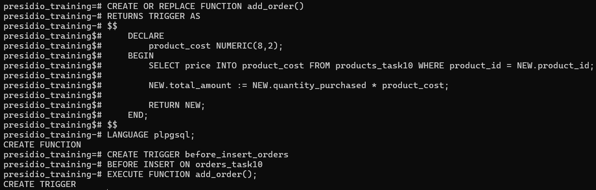

### After Insert Trigger

``` sql
CREATE OR REPLACE FUNCTION products_update()
RETURNS TRIGGER AS
$$
    BEGIN
        UPDATE products_task10
        SET quantity  = quantity - NEW.quantity_purchased
        WHERE product_id = NEW.product_id;

        RETURN NEW;
    END;
$$
LANGUAGE plpgsql;
```

``` sql
CREATE TRIGGER after_insert_orders 
AFTER INSERT ON orders_task10
FOR EACH ROW
EXECUTE FUNCTION products_update();
```

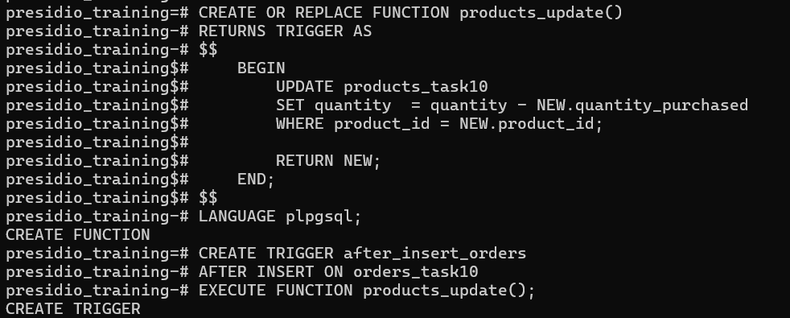


## 4. Testing Trigger

### Before adding order
`Products_task10` table
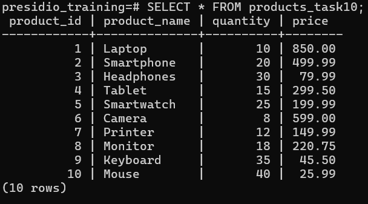

### Adding Order
``` sql
INSERT INTO orders_task10 (customer_id, product_id, quantity_purchased)
VALUES (1,1,2);
```
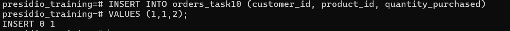

### After adding Order
Checking `orders_task10` and `products_task10` tables
``` sql
SELECT * FROM orders_task10;
SELECT * FROM products_task10;
```
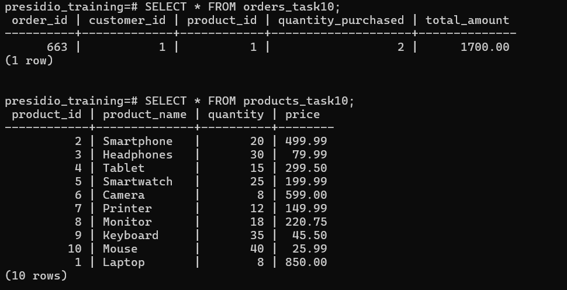


## 5. Use Transactions

``` sql
BEGIN TRANSACTION

UPDATE products_task10
SET quantity = quantity + 2
WHERE product_id = 1;

DELETE FROM orderS_task10;

COMMIT
```

### Failed Transaction rollbacked

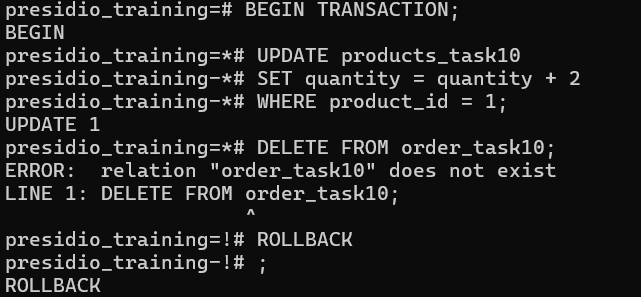

### Successful Transaction Committed

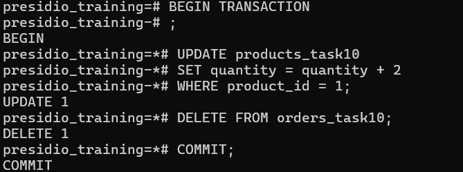

``` sql
SELECT * FROM products_task10;
SELECT * FROM orders_task10;
```
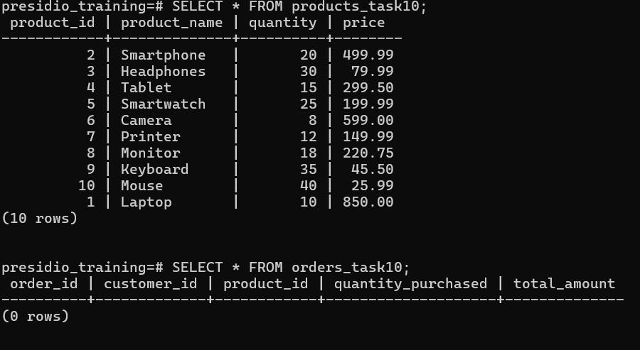


## 6. Create view - `orders_task10_view`

### Create view joining `orders_task10`, `products_task10` and `customers_task10`
``` sql
CREATE VIEW orders_task10_view AS
SELECT o.order_id, c.customer_name, p.product_name, p.price, o.quantity_purchased, o.total_amount
FROM orders_task10 o 
JOIN customers_task10 c ON o.customer_id = c.customer_id
JOIN products_task10 p ON o.product_id = p.product_id;
```

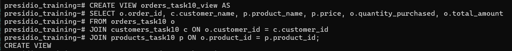

``` sql
SELECT * FROM orders_task10_view;
```
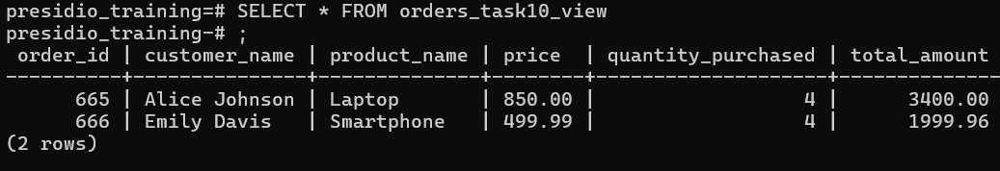


## 7. Analyze query performance and Apply indexing strategies

### Analyze query performance - Before adding index
``` sql
EXPLAIN ANALYZE SELECT * FROM orders_task10;
```
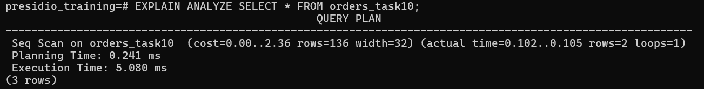

### Adding index
``` sql
CREATE INDEX idx_customer_product ON orders_task10(customer_id, product_id);
```
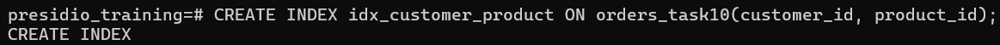


### Analyze query performance - After adding index
``` sql
EXPLAIN ANALYZE SELECT * FROM orders_task10;
```
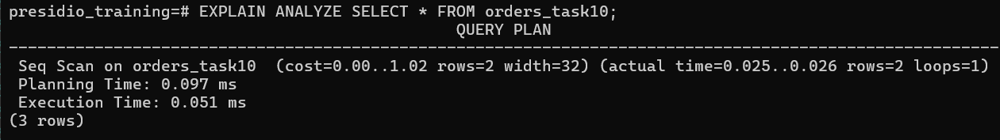
