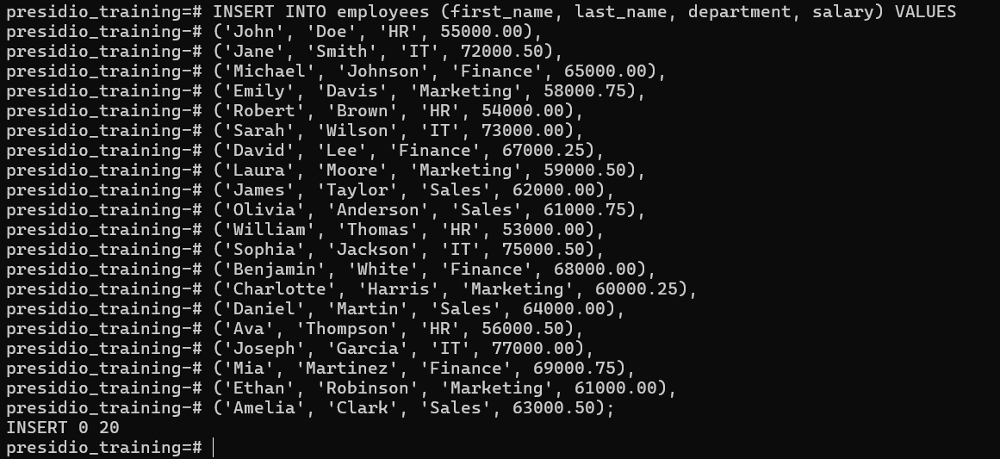

# Task 2

## **Basic Filtering and Sorting**
    
**Objective:**
    
- Write queries that filter records and sort the result set.
    
**Requirements:**
    
- Use the `WHERE` clause to filter records based on a condition (e.g., `WHERE Department = 'Sales'`).
- Apply the `ORDER BY` clause to sort the results (e.g., by `LastName` or `Salary`).
- Experiment with multiple conditions using `AND`/`OR`.

# Steps Followed:

## 1. Create Table `Employees`

``` sql
CREATE TABLE employees (employee_id serial PRIMARY KEY, first_name varchar(50), last_name varchar(50), department varchar(20),salary numeric(8,2));
```


## 2. Insert data into Table

``` sql
INSERT INTO employees (first_name, last_name, department, salary) VALUES
('John', 'Doe', 'HR', 55000.00),
('Jane', 'Smith', 'IT', 72000.50),
('Michael', 'Johnson', 'Finance', 65000.00),
('Emily', 'Davis', 'Marketing', 58000.75),
('Robert', 'Brown', 'HR', 54000.00),
('Sarah', 'Wilson', 'IT', 73000.00),
('David', 'Lee', 'Finance', 67000.25),
('Laura', 'Moore', 'Marketing', 59000.50),
('James', 'Taylor', 'Sales', 62000.00),
('Olivia', 'Anderson', 'Sales', 61000.75),
('William', 'Thomas', 'HR', 53000.00),
('Sophia', 'Jackson', 'IT', 75000.50),
('Benjamin', 'White', 'Finance', 68000.00),
('Charlotte', 'Harris', 'Marketing', 60000.25),
('Daniel', 'Martin', 'Sales', 64000.00),
('Ava', 'Thompson', 'HR', 56000.50),
('Joseph', 'Garcia', 'IT', 77000.00),
('Mia', 'Martinez', 'Finance', 69000.75),
('Ethan', 'Robinson', 'Marketing', 61000.00),
('Amelia', 'Clark', 'Sales', 63000.50);
```



## 3. Use the `WHERE` clause to filter records based on a condition

``` sql
SELECT * FROM employees where department='Sales';
```


## 4. Use `ORDER BY` clause to sort the results

### Without Sorting

``` sql
SELECT * FROM employees;
```


### After Sorting

``` sql
SELECT * FROM employees ORDER BY salary;
```


## 5. Use `AND` operation on condition

``` sql
SELECT * FROM employees WHERE department = 'IT' AND salary >= 75000;
```


## 5. Use `OR` operation on condition

``` sql
SELECT * FROM employees WHERE department = 'HR' OR salary >= 65000;
```


