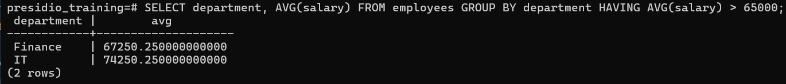

# Task 3

## **Simple Aggregation and Grouping**
    
**Objective:**
    
- Summarize data using aggregate functions and grouping.
    
**Requirements:**
    
- Write a query that uses aggregate functions such as `COUNT()`, `SUM()`, or `AVG()` to calculate totals or averages.
- Use the `GROUP BY` clause to aggregate data by a specific column (e.g., count the number of employees per department).
- Optionally, filter grouped results using the `HAVING` clause.


# Steps Followed:

## 1. Use `AVG()` - Aggregate function to find the average of attribute.

### Finding average salary of employees
``` sql
SELECT AVG(salary) as avg_salary FROM employees;
```


## 2. Use `COUNT()` - Aggregate function to find the count of records.

### Finding total no. of employees having salary greater than 65k
``` sql
SELECT COUNT(*) as "Salary greater than 65K" FROM employees where salary> 65000;
```


## 3. Use `SUM()` - Aggregate function to find the sum of the records.

### Finding total salary earned by marketing department
``` sql
SELECT SUM(salary) as "Marketing Total Salary" from employees where department = 'Marketing';
```


## 4. Use `GROUP BY` statement - to group records based on attribute.

### Finding the count of employees in each department
``` sql
SELECT department, COUNT(*) FROM employees GROUP BY department;
```


## 5. Use `GROUP BY` and `HAVING` clause - to filter the grouped records.

### Finding the departments which has average salary greater than 65K.
``` sql
SELECT department, AVG(salary) FROM employees GROUP BY department HAVING AVG(salary) > 65000;
```
