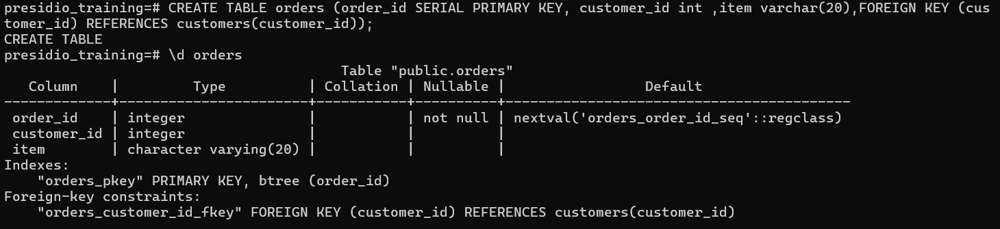
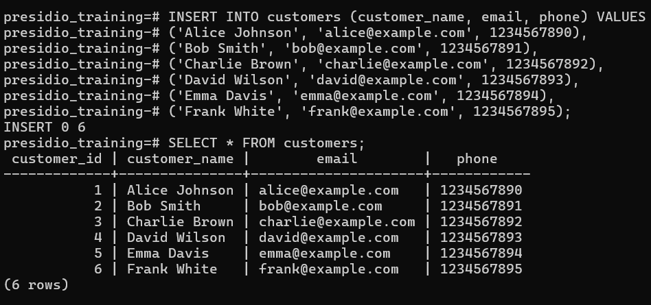
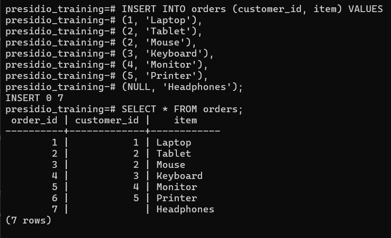
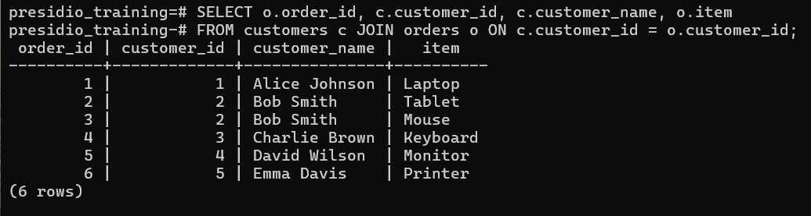
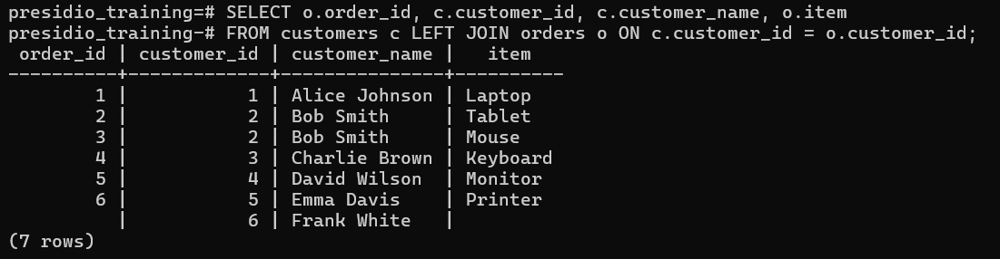
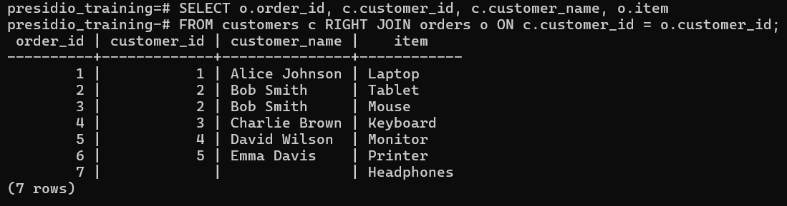
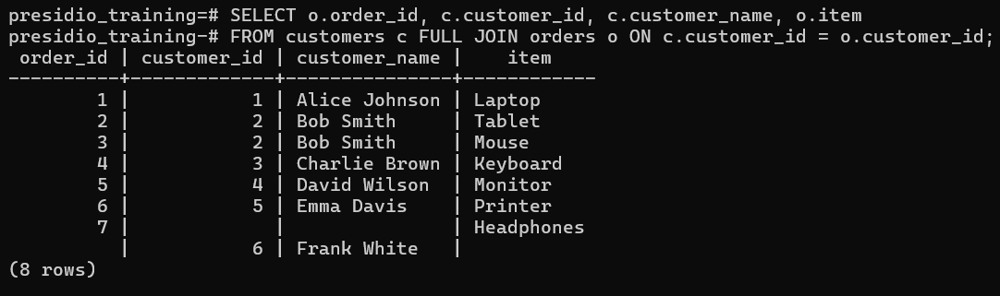

# Task 4

## **Multi-Table JOINs**
    
**Objective:**
    
- Combine data from two related tables using JOIN operations.
    
**Requirements:**
    
- Create two related tables (e.g., `Customers` and `Orders`) with a foreign key relationship.
- Write an `INNER JOIN` query to retrieve combined information (e.g., customer names along with their order details).
- Experiment with other types of joins such as `LEFT JOIN` to understand how missing matches are handled.


# Steps Followed:

## 1. Create two tables - `Customers` and `Orders`

### `Customers` Table
``` sql
CREATE TABLE customers(customer_id SERIAL PRIMARY KEY, customer_name VARCHAR(50),email VARCHAR(50) CHECK (email LIKE '%@%.%'), phone NUMERIC(10) UNIQUE CHECK (phone > 1000000000));
```


### `Orders` Table
``` sql
CREATE TABLE orders (order_id SERIAL PRIMARY KEY, customer_id int, item varchar(20), FOREIGN KEY (customer_id) REFERENCES customers(customer_id));
```



## 2. Populate data in two tables - `Customers` and `Orders`

### Insert data into `Customers` Table
``` sql
INSERT INTO customers (customer_name, email, phone) VALUES
('Alice Johnson', 'alice@example.com', 1234567890),
('Bob Smith', 'bob@example.com', 1234567891),
('Charlie Brown', 'charlie@example.com', 1234567892),
('David Wilson', 'david@example.com', 1234567893),
('Emma Davis', 'emma@example.com', 1234567894),
('Frank White', 'frank@example.com', 1234567895);

SELECT * FROM customers;
```


### Insert data into `Orders` Table
``` sql
INSERT INTO orders (customer_id, item) VALUES
(1, 'Laptop'),
(2, 'Tablet'),
(2, 'Mouse'),
(3, 'Keyboard'),
(4, 'Monitor'),
(5, 'Printer'),
(NULL, 'Headphones'); 

SELECT * FROM orders;
```



## 3. Use `JOIN` query to retrieve order details along with customer's name

``` sql
SELECT o.order_id, c.customer_id, c.customer_name, o.item 
FROM customers c JOIN orders o ON c.customer_id = o.customer_id;
```



## 4. Use `LEFT JOIN`
``` sql
SELECT o.order_id, c.customer_id, c.customer_name, o.item 
FROM customers c LEFT JOIN orders o ON c.customer_id = o.customer_id;
```


## 5. Use `RIGHT JOIN`
``` sql
SELECT o.order_id, c.customer_id, c.customer_name, o.item 
FROM customers c RIGHT JOIN orders o ON c.customer_id = o.customer_id;
```


## 6. Use `FULL JOIN`
``` sql
SELECT o.order_id, c.customer_id, c.customer_name, o.item 
FROM customers c FULL JOIN orders o ON c.customer_id = o.customer_id;
```
