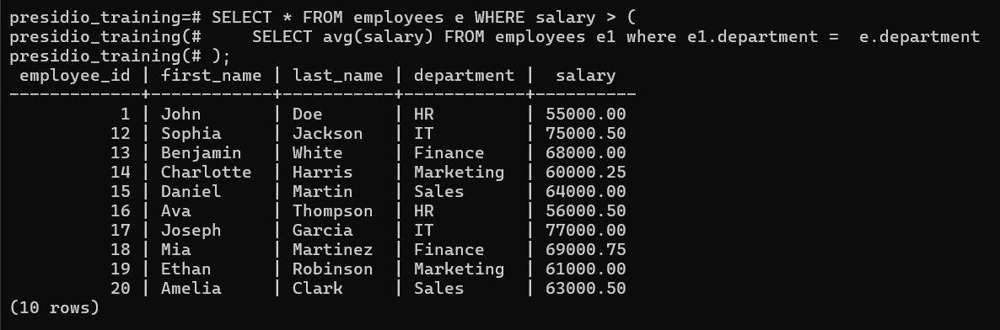
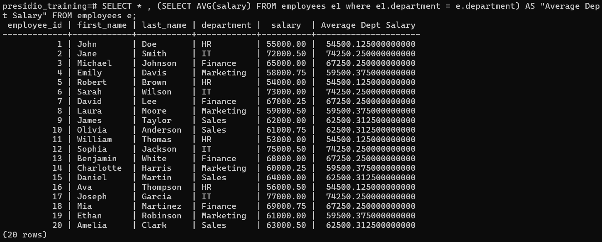

# Task 5

## **Subqueries and Nested Queries**
    
**Objective:**
    
- Use subqueries to filter or compute values within a main query.
    
**Requirements:**
    
- Write a query that uses a subquery in the `WHERE` clause (e.g., select employees whose salary is above the department’s average salary).
- Alternatively, use subqueries in the `SELECT` list to compute dynamic columns.
- Understand the difference between correlated and non-correlated subqueries.

# Steps Followed:

## 1. Use subquery in `WHERE` clause

### Finding employees having salary greater than their department's average salary 

``` sql
SELECT * FROM employees e WHERE salary > (
    SELECT avg(salary) FROM employees e1 where e1.department =  e.department
);
```


## 2. Use subquery in `SELECT` statement

### Displaying employee details along with average salary of their department

``` sql
SELECT * , (SELECT AVG(salary) FROM employees e1 where e1.department = e.department) AS "Average Dept Salary" FROM employees e;
```


## 3. Difference Between correlated and non-correlated subqueries

### Correlated Subqueries
- Needs to execute subquery for each row of main query 


### Non-Correlated Subqueries
- Subquery is executed once before the main query
- No reference to any columns of main query in subquery