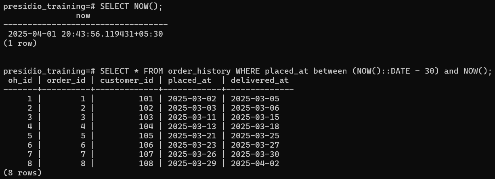

# Task 6

## **Date and Time Functions**
    
**Objective:**
    
- Manipulate and query data based on date and time values.
    
**Requirements:**
    
- Use built-in date functions (e.g., `DATEDIFF`, `DATEADD`, or your SQL dialect’s equivalent) to calculate intervals or adjust dates.
- Write a query to filter records based on date ranges (e.g., orders placed within the last 30 days).
- Format date outputs if necessary using functions like `CONVERT` or `TO_CHAR`.


# Steps Followed:

## 1. Create `Order History` table and Insert data

``` sql
CREATE TABLE order_history (oh_id SERIAL PRIMARY KEY, order_id int, customer_id int, placed_at DATE, delivered_at DATE);
```


### Populate data

``` sql
INSERT INTO order_history (order_id, customer_id, placed_at, delivered_at) VALUES
(1, 101, '2025-03-01', '2025-03-05'),
(2, 102, '2025-03-02', '2025-03-06'),
(3, 103, '2025-03-10', '2025-03-15'),
(4, 104, '2025-03-12', '2025-03-18'),
(5, 105, '2025-03-20', '2025-03-25'),
(6, 106, '2025-03-22', '2025-03-27'),
(7, 107, '2025-03-25', '2025-03-30'),
(8, 108, '2025-03-28', '2025-04-02'),
(9, 109, '2025-04-01', '2025-04-05'),
(10, 110, '2025-04-03', '2025-04-08');

SELECT * FROM order_history;
```


## 2. Calculate Interval between `delivered_at`and `placed_at`

``` sql
SELECT *, (delivered_at - placed_at) AS "Delivery Duration" FROM order_history;
```


## 3. Adjust Dates - Incrementing `placed_at` by 1 day

``` sql
UPDATE order_history
SET placed_at = placed_at + 1;

SELECT *, (delivered_at - placed_at) AS "Delivery Duration" FROM order_history;
```


## 4. Filter records based on date ranges - retrieve records placed within 30 days

``` sql
SELECT NOW();
SELECT * FROM order_history WHERE placed_at between(NOW()::DATE - 30) AND NOW();
```



## 5. Format Date

``` sql
SELECT oh_id, customer_id, TO_CHAR(placed_at,'d-mm-yyyy'), TO_CHAR(delivered_at, 'dd Mon yyyy') FROM order_history;
```

