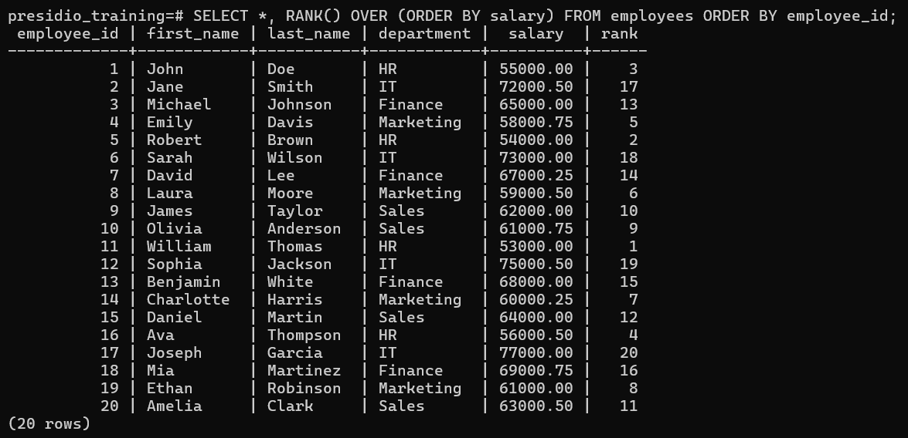
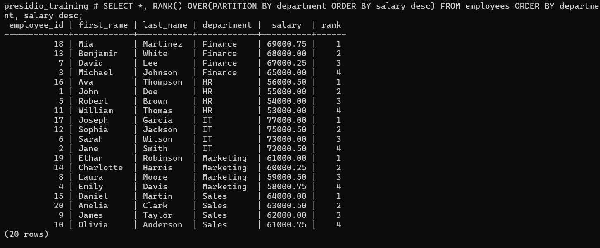
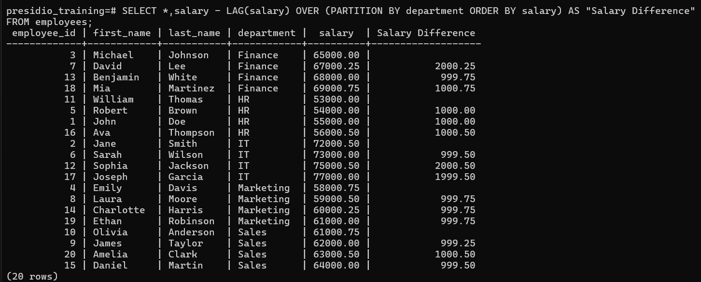

# Task 7

## **Window Functions and Ranking**
    
**Objective:**
    
- Leverage window functions to perform calculations across a set of rows.
    
**Requirements:**
    
- Write a query using window functions such as `ROW_NUMBER()`, `RANK()`, or `DENSE_RANK()` to assign ranks (e.g., rank employees by salary within each department).
- Use `PARTITION BY` to define groups and `ORDER BY` to specify the ranking order.
- Experiment with other window functions like `LEAD()` or `LAG()` to access adjacent row values. 


# Steps Followed:

## 1. Use window function - `RANK()`

``` sql
SELECT *, RANK() OVER (ORDER BY salary) FROM employees ORDER BY employee_id;
```


## 2. Use window function with `PARTITION BY` clause

``` sql
SELECT *, RANK() OVER(PARTITION BY department ORDER BY salary desc) FROM employees ORDER BY department, salary desc;
``` 


## 3. Use `LAG` clause - to compare with Previous record of same attribute

### Finding salary difference between employees of same department
``` sql
SELECT *,salary - LAG(salary) OVER (PARTITION BY department ORDER BY salary) AS "Salary Difference" FROM employees;
```
