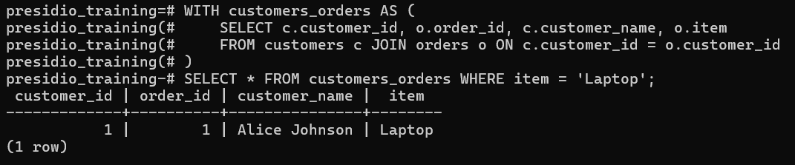
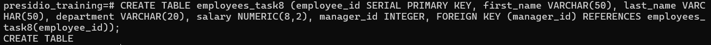
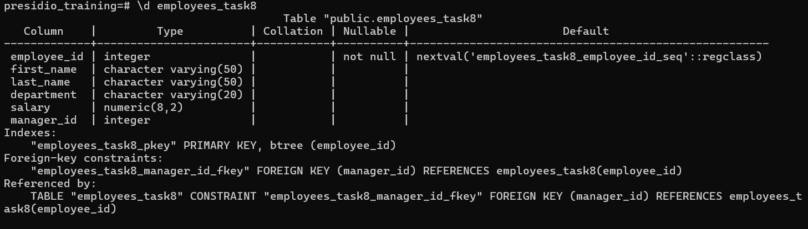
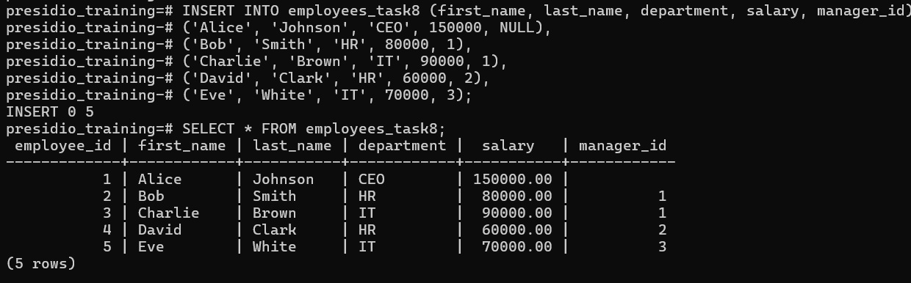
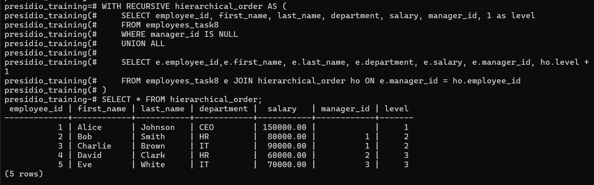

# Task 8

## **Common Table Expressions (CTEs) and Recursive Queries**
    
**Objective:**
    
- Simplify complex queries and process hierarchical data using CTEs.
    
**Requirements:**
    
- Write a non-recursive CTE to structure a multi-step query for readability (e.g., breaking down a complex aggregation).
- Create a recursive CTE to display hierarchical data (e.g., an organizational chart or a category tree).
- Ensure proper termination of the recursive CTE to avoid infinite loops.

# Steps Followed:

## 1. Non- recursive CTE

### Retrive Customer name who bought laptop
``` sql
WITH customers_orders AS (
    SELECT c.customer_id, o.order_id, c.customer_name, o.item
    FROM customers c JOIN orders o ON c.customer_id = o.customer_id
)
SELECT * FROM customers_orders WHERE item = 'Laptop';
```



## 2. Recursive CTE

### Create Heirarchical data table
``` sql
CREATE TABLE employees_task8 (employee_id SERIAL PRIMARY KEY, first_name VARCHAR(50), last_name VARCHAR(50), department VARCHAR(20), salary NUMERIC(8,2), manager_id INTEGER, FOREIGN KEY (manager_id) REFERENCES employees_task8(employee_id));
```



### Populate data
``` sql
INSERT INTO employees_task8 (first_name, last_name, department, salary, manager_id) VALUES
('Alice', 'Johnson', 'CEO', 150000, NULL), 
('Bob', 'Smith', 'HR', 80000, 1),  
('Charlie', 'Brown', 'IT', 90000, 1),  
('David', 'Clark', 'HR', 60000, 2), 
('Eve', 'White', 'IT', 70000, 3);

SELECT * FROM employees_task8;
```


### Perform Recursive CTE - to find hierarchical level of employees

``` sql
WITH RECURSIVE hierarchical_order AS (
    SELECT employee_id, first_name, last_name, department, salary, manager_id, 1 as level
    FROM employees_task8
    WHERE manager_id IS NULL
    UNION ALL

    SELECT e.employee_id,e.first_name, e.last_name, e.department, e.salary, e.manager_id, ho.level +1
    FROM employees_task8 e JOIN hierarchical_order ho ON e.manager_id = ho.employee_id
)
SELECT * FROM hierarchical_order;
```


