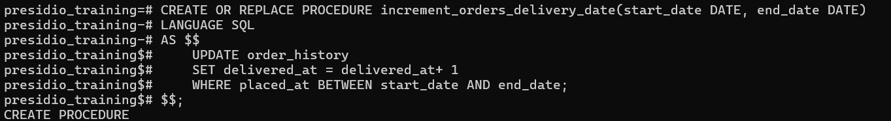
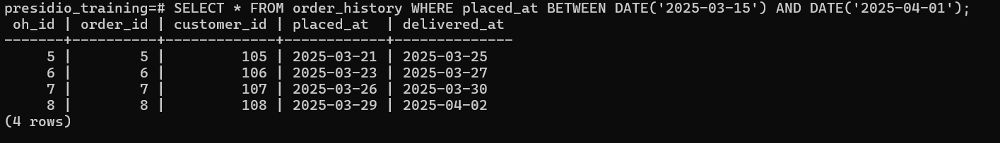
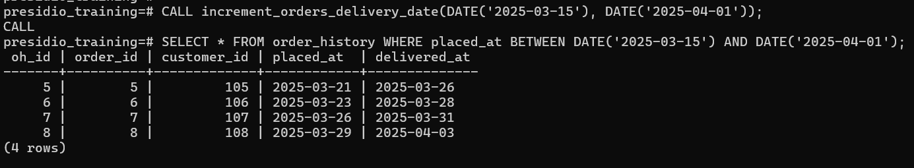
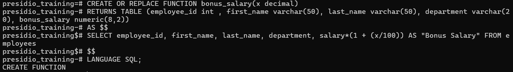
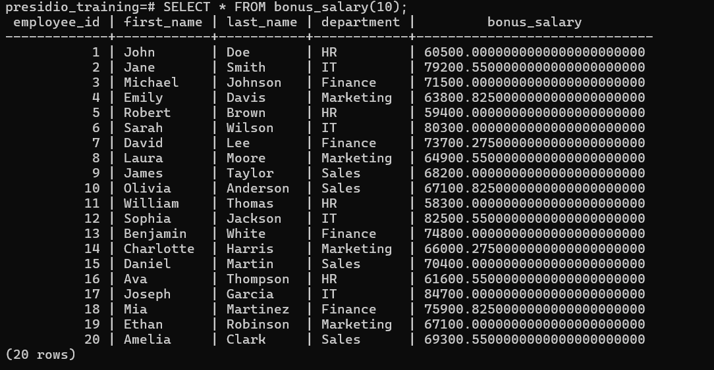

# Task 9

## *Stored Procedures and User-Defined Functions**
    
**Objective:**
    
- Encapsulate business logic using stored procedures and functions.
    
**Requirements:**
    
- Create a stored procedure that accepts parameters (e.g., a date range) and returns a result set (such as total sales within that range).
- Write a scalar or table-valued user-defined function that performs a calculation (e.g., calculates a discount or bonus based on input parameters).
- Test the procedure and function by calling them and verifying their outputs.


# Steps Followed:

## 1. Create a stored procedure with paramaters

### A procedure to update the orders placed between `start_date` and `end_date` - increment `delivered_at` by 1 day
``` sql
CREATE OR REPLACE PROCEDURE increment_orders_delivery_date(start_date DATE, end_date DATE)
LANGUAGE SQL
AS $$
    UPDATE order_history
    SET delivered_at = delivered_at+ 1
    WHERE placed_at BETWEEN start_date AND end_date;
$$;
```


Before Proceduce Call
``` sql 
SELECT * FROM order_history WHERE placed_at BETWEEN DATE('2025-03-15') AND DATE('2025-04-01');
```


After Procedure Call
``` sql
CALL increment_orders_delivery_date(DATE('2025-03-15'), DATE('2025-04-01'));

SELECT * FROM order_history WHERE placed_at BETWEEN DATE('2025-03-15') AND DATE('2025-04-01');
```



## 2. Table-valued user-defined function that performs a calculation

### Displaying x% increased bonus salary

``` sql
CREATE OR REPLACE FUNCTION bonus_salary(x decimal)
RETURNS TABLE (employee_id int , first_name varchar(50), last_name varchar(50), department varchar(20), bonus_salary numeric(8,2))
AS $$
SELECT employee_id, first_name, last_name, department, salary*(1 + (x/100)) AS "Bonus Salary" FROM employees
$$
LANGUAGE SQL;
```



``` sql
SELECT * FROM bonus_salary(10);
```



